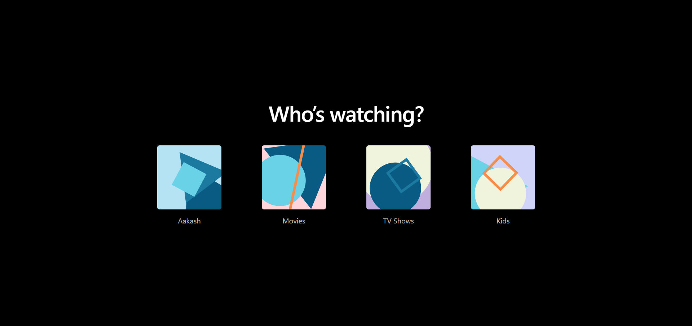
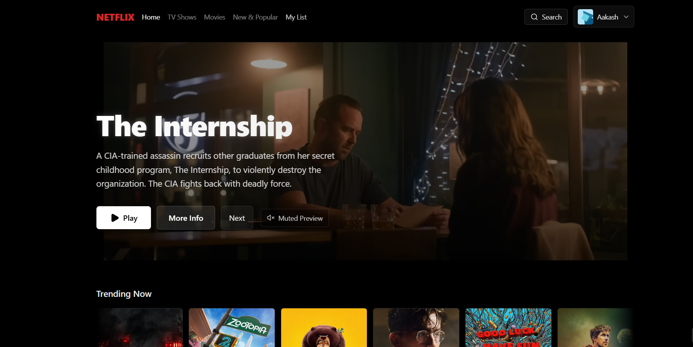
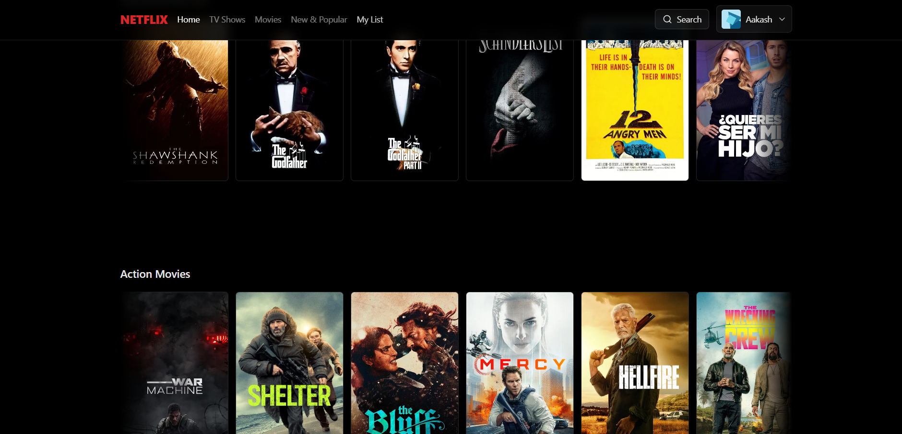
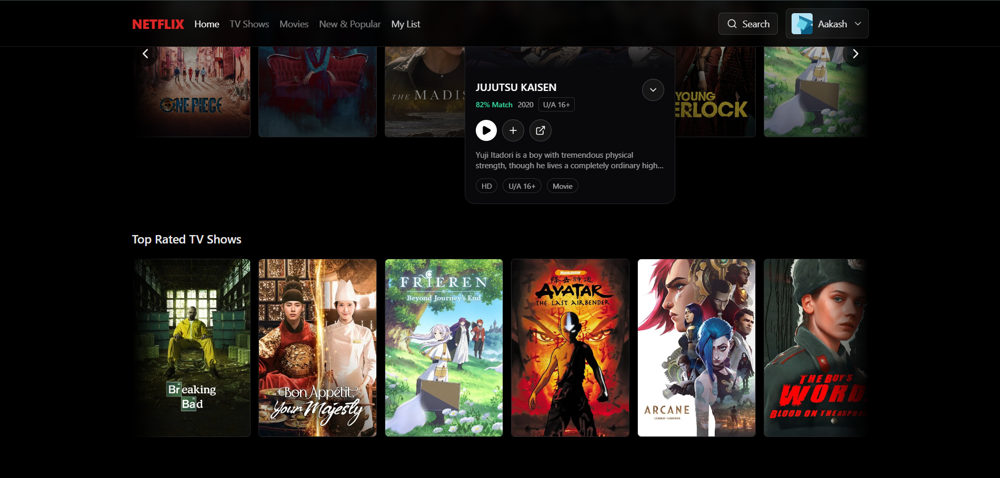
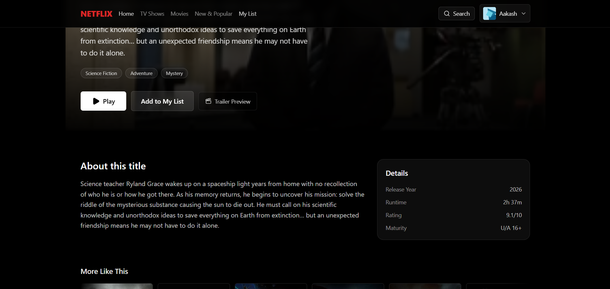
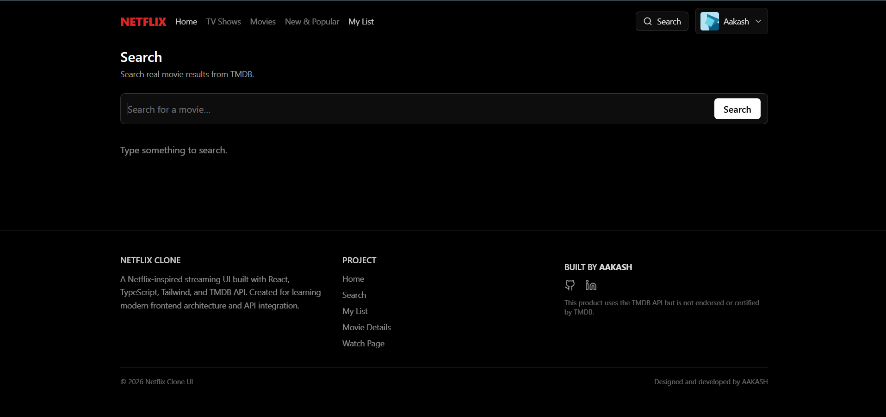
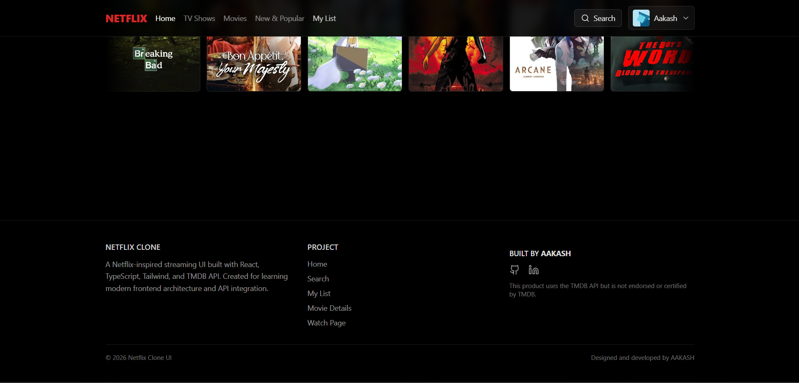

# Netflix Clone

A modern Netflix-inspired streaming UI built using React, TypeScript, Vite, and Tailwind CSS, powered by the TMDB API.

This project recreates the core user experience of Netflix including movie browsing, search, trailers, watch pages, and user-specific features like My List and Continue Watching.

# Live Demo
( https://netflix-clone-lac-six-38.vercel.app/ )

# Screenshots :
 







# Features

## Core UI

- Netflix-style Hero Banner
- Movie rows with horizontal scroll
- Hover movie preview cards
- Movie detail page
- Trailer playback
- Watch page with progress tracking
- Responsive layout

---

## User Features

- Profile selector
- Continue Watching
- My List
- Resume watch progress
- Trailer modal player

---

## Movie Features

- Trending movies
- Top rated movies
- Action movies
- Comedy movies
- Real data from TMDB API

---


## Navigation

- Home
- Search
- My List
- Movie Details
- Watch Page

---


## UI Enhancements

- Netflix gradient titles
- Cinematic vignette hero
- Ken Burns hero animation
- Skeleton loaders
- Responsive navbar
- Hover preview trailers

---

# Tech Stack

## Frontend

- React
- TypeScript
- Vite
- Tailwind CSS

## Routing

- React Router

## Icons

- Lucide React

## Data API

- TMDB (The Movie Database)

## Other Libraries

- React Query
- Axios

---
```

# Project Structure

src
 ┣ components
 ┃ ┣ Navbar
 ┃ ┣ HeroBanner
 ┃ ┣ Row
 ┃ ┣ PosterCard
 ┃ ┣ TitleModal
 ┃ ┣ TrailerPlayer
 ┃ ┣ Footer
 ┃ ┗ ProfileSelector
 ┃
 ┣ hooks
 ┃ ┣ useMyList
 ┃ ┣ useContinueWatching
 ┃ ┗ useProfiles
 ┃
 ┣ pages
 ┃ ┣ Home
 ┃ ┣ Search
 ┃ ┣ MyList
 ┃ ┣ MovieDetails
 ┃ ┗ Watch
 ┃
 ┣ lib
 ┃ ┗ tmdb.js
 ┃
 ┣ utils
 ┃ ┗ format.ts
 ┃
 ┗ app
   ┗ App.tsx


```
---

# Environment Variables

Create a `.env` file in the root of the project.


VITE_TMDB_TOKEN=your_tmdb_bearer_token
VITE_TMDB_BASE_URL=https://api.themoviedb.org/3

VITE_TMDB_IMAGE_URL=https://image.tmdb.org/t/p


You can get the API token from:

https://www.themoviedb.org/settings/api

---

# Installation

Clone the repository:


git clone https://github.com/aako-aakash/netflix-clone.git


Navigate into the project:


cd netflix-clone


Install dependencies:


npm install


Run the development server:


npm run dev


---

# Production Build

Create the production build:


npm run build


Preview the production build locally:


npm run preview


---

# Deployment

This project is optimized for **Vercel deployment**.

### Step 1
Push the project to **GitHub**.

### Step 2
Go to:

https://vercel.com

### Step 3
Import your GitHub repository.

### Step 4
Add environment variables:


VITE_TMDB_TOKEN
VITE_TMDB_BASE_URL
VITE_TMDB_IMAGE_URL


### Step 5
Deploy.

---

# Vercel SPA Routing Fix

Create a `vercel.json` file:


{
"rewrites": [
{ "source": "/(.*)", "destination": "/" }
]
}


This ensures that routes like:


/movie/:id
/watch/:id


work correctly after refresh.

---

# License

MIT License

---

# Credits

Built by **AAKASH**

GitHub  
https://github.com/aako-aakash

LinkedIn  
https://www.linkedin.com/in/akash-kumar-saw-bb1630258

---

# TMDB Notice

This product uses the **TMDB API** but is **not endorsed or certified by TMDB**.

---

# Future Improvements

Possible upgrades:

- TV shows support
- Better recommendation engine
- User authentication
- Backend watch history
- Advanced search filters
- Mobile gesture navigation

---

# Author

**AAKASH**  

GitHub  
https://github.com/aako-aakash

LinkedIn  
https://www.linkedin.com/in/akash-kumar-saw-bb1630258


